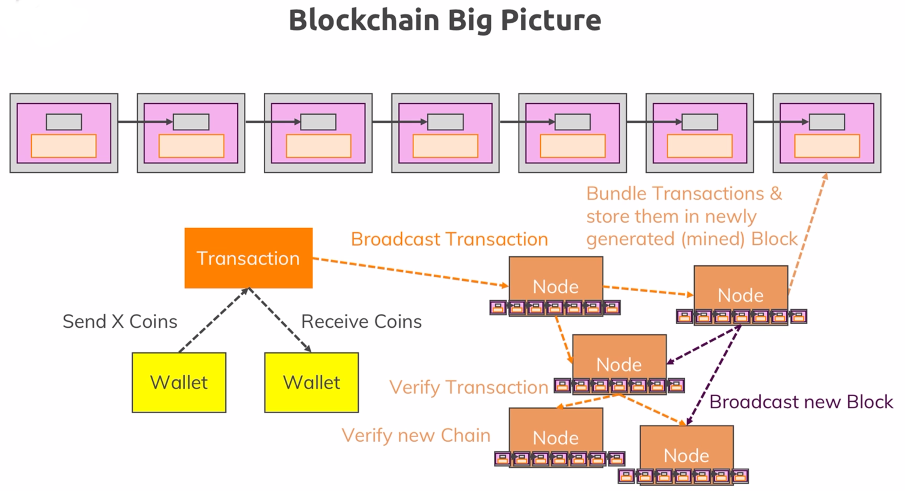

# Nodes

>


## API

Call the API via:

- Browser (limited usage)
- HTTP Client such as [Insomnia](https://insomnia.rest/)
- HTTP command line client such as OS built in **curl**, or better [httpie](https://httpie.org) which we'll see examples below

### Add a Peer Node

```bash
$ http POST localhost:5000/node node-ip=localhost:5002
HTTP/1.0 201 CREATED
...
{
    "data": {
        "message": "Node added successfully",
        "nodes": [
            "localhost:5001",
            "localhost:5002"
        ]
    }
}
```

### Remove a Peer Node

```bash
$ http DELETE localhost:5000/node/localhost:5001
HTTP/1.0 200 OK
...
{
    "data": {
        "message": "Node localhost:5001 removed",
        "nodes": [
            "localhost:5002"
        ]
    }
}
```

### Get all Nodes

```bash
$ http localhost:5000/nodes
HTTP/1.0 200 OK
...
{
    "data": {
        "nodes": [
            "localhost:5002"
        ]
    }
}
```

### UI

The APIs can be accessed via a UI instead from your [browser](http://localhost:5000/network).