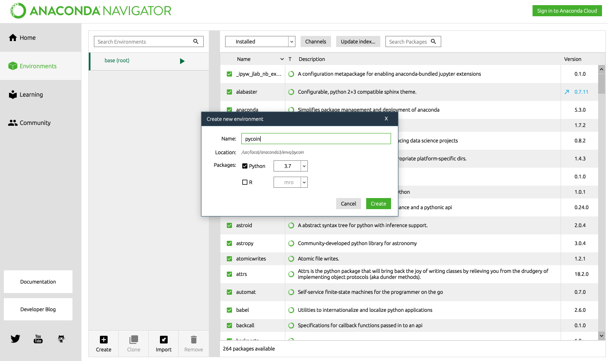
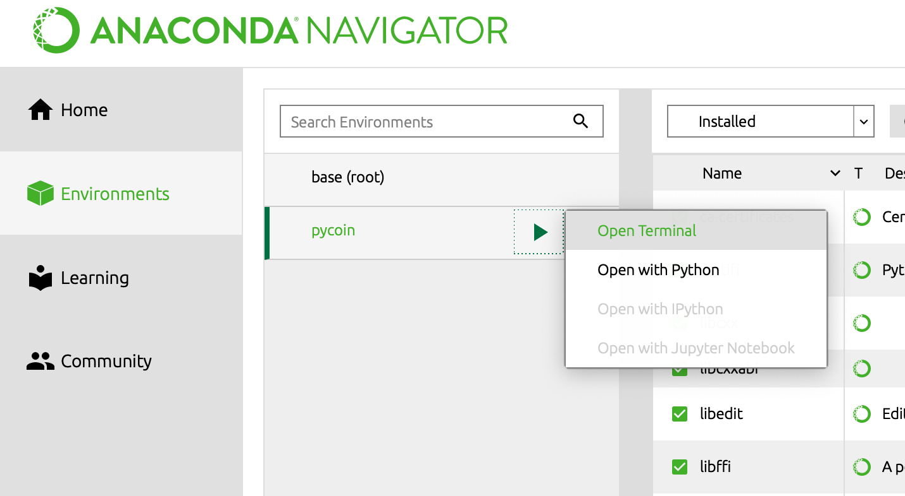
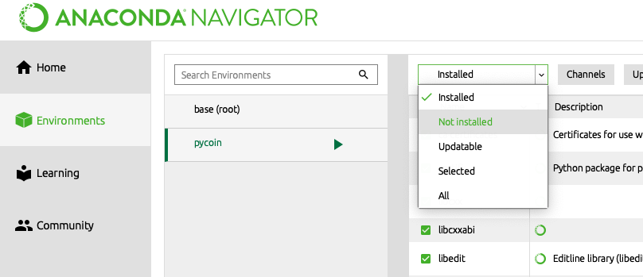
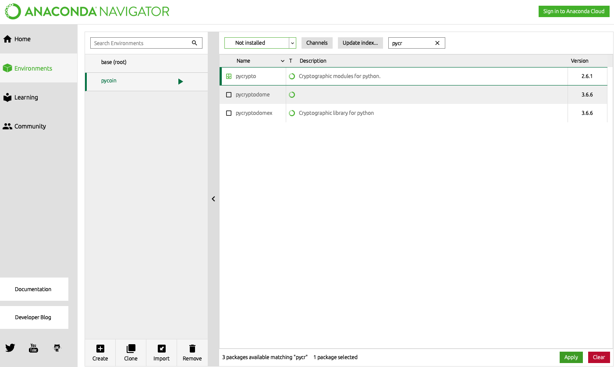

# Setup

Apologies I shall only cover **Mac** - One day I may include Linux and Windows.

Initially follow the [parent setup](../docs/setup.md) to this one. It is quite long but get your Python into the right place, so to speak.

Ok! So I trust you have Python all setup... just how we need it i.e. did you really follow the [parent setup](../docs/setup.md)?

We need some third party modules. We could just install globally, e.g. we need **pycrypto**:

```bash
pip install pycrypto
```

But since we now have **Anaconda** installed, let's use the **Navigator** to install within a virtual environment pertaining to our module. So boot the Navigator:

```bash
anaconda-navigator
```

In **Environments** choose to **Create** a new environment and name it **pycoin**.

> 

And then open a terminal to the new environment, where we can navigate to our project and as above, install our third party packages (when you think about it, this is all a bit naff compared to other languages).

> 

**One problem** I encountered here was that it seems that **zsh** is not supported, so you would have to use **bash** instead... again, all a tad naff.

Workaround for Anaconda Navigator not playing nicely with zsh:

- Ctrl-C out of the Navigator if it is currently running

- Before rerunning the Navigator, switch from **zsh** to **bash**:

  ```bash
  chsh -s /bin/bash
  ```

  and once again, follow the step above. When all done you can switch back to your beautiful **zsh**:

  ```bash
  chsh -s /bin/zsh
  ```

We can then work in a terminal instantiated from our new environment in the Navigator and perform the above steps, such as **pip install pycrypto** and continue playing around within said terminal.

If we wish to continue with installing a third party for our new virtual environment, so long as we don't have to use the terminal in the Navigator, then we don't have to switch shells. Regarding this (long winded approach) we want the **pycrypto** third party installed in our virtual environment. In the Navigator click the "Installed" dropdown to select "Not Installed":

> 

and **search**, select and **apply** the module **pycrypto**:

> 

We can go back to our usual terminal e.g. the terminal within our project's IDE such as [Visual Studio Code](https://code.visualstudio.com) and do the following (Noting that I can't believe I've just plugged a Microsoft product - and can't believe how good it is):

```bash
source activate pycoin
```

After all that, I just went **global** to avoid this very odd and laborious way of achieving something so simple in other languages. Shame, because I like Python, but come on!